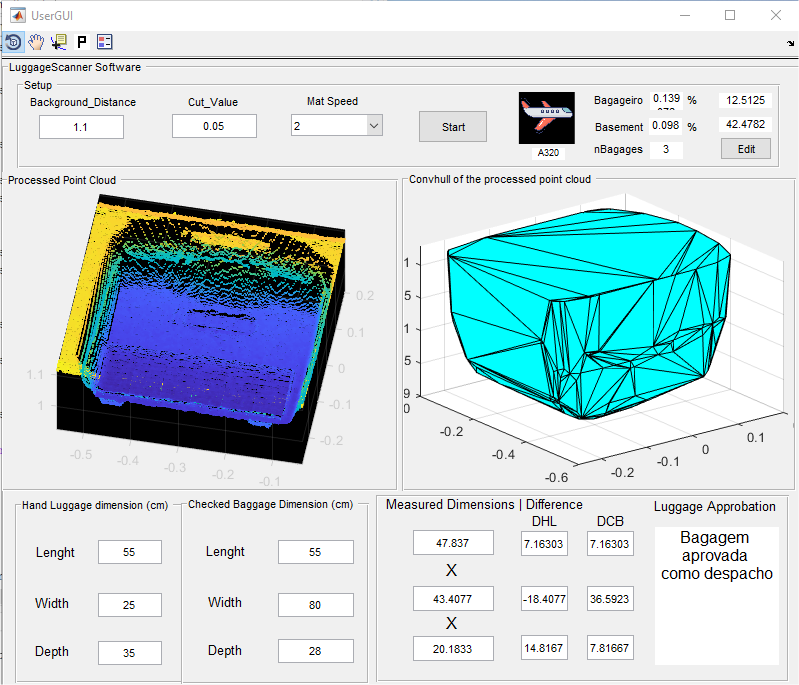

# Luggage Dimension Scanner Software

Este software tem o objetivo de ser uma ferramenta para auxílio nas atividades operacionais de empresas aéreas quanto ao check-in de bagagens.
A principal função é realizar medidas de bagagens aeroportuárias. Para tanto o sistema é composto pelo seguintes componentes:
- Software: 
	- Código em Matlab: controla o Scanner Kinect V2 e a esteira via porta serial
	- Código da esteira: produzido para Arduino permite o controle da esteira, que move a mala pela área de ação do sensor
- Hardware:
	- Kinect V2;
	- Esteira customizada capas de mover uma mala por de baixo do sensor. Contem uma base móvel para posicionamento do Kinect, posição padrão 90° à 1,1m de altura

### Informações importantes

- Tecnologias utilizadas no desenvolvimento do presente código:
    - Matlab 2020a
    - Kinect V2

### Executando o software:

- Para executar esse programa, é necessário instalar as dependências:
	- Image aquisition toolbox
	- Kinect for matlab package
	- Dependendo do método utilizado para medida, os dois seguintes packages devem ser adicionados
		- [Minimal Bounding Box](https://www.mathworks.com/matlabcentral/fileexchange/18264-minimal-bounding-box) (by Johannes Korsawe)
		- [2D minimal bounding box ](https://www.mathworks.com/matlabcentral/fileexchange/31126-2d-minimal-bounding-box) (by Julien diener)

- Executando o software:
	1. Abra o diretório do projeto com o Matlab
	2. O ponto de entrada é o arquivo UserGui.m que é uma view
	3. Antes de executá-lo certifique-se de adicionar todas as pastas do diretório raiz ao search path do matlab:
		- Basta abrir o diretório com o matlab, selecionar a pasta na arvore de diretórios, clicar com o botão direito e adicionar tudo, inclusive as subpastas
	4. Também certifique-se de instalar as dependências indicadas 
	5. No arquivo UserGui.m clique no botão de "Run" no menu de editor

### Interface de usuário

